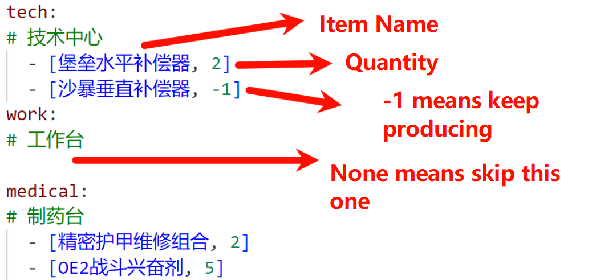

## ✔ Updates
Please star the project, thank you!  
There likely won't be any more functional updates.  
Update to the latest version to support **Season S5 - Breaking the Wall**.

## Disclaimer
This project is developed solely for **technical learning and communication** purposes. It is **not a game plugin or cheating tool**. Any commercial use or violations of the game's terms of service are strictly prohibited.

## Project Overview
Please star the project, thank you!

This is a program that automates in-game manufacturing using screenshots and mouse simulation (i.e., mouse macros). It does **not** read or modify any game data, so there is no risk of being banned. Estimated profit: **1.5 million Havre coins/day** or 10 million/week.

The workflow is roughly: Screenshot → OCR text recognition → Simulate mouse and keyboard input.

## User Guide
### 1. Download and Extract:
Go to https://github.com/yi-zelin/DeltaForceSS/releases and download the latest zip file.  
**Extract to a path with ONLY English characters!!! (Tesseract uses C/C++ interface which only supports ASCII)**

> After extracting, you’ll get: 3 files and an OCR program folder:  
> * **`Tesseract-OCR`**: OCR program folder  
> * **`config.yaml`**: Item database  
> * **`user_config.yaml`**: User configuration file containing items to be manufactured  
> * **`特勤处脚本.exe`**: Main program, must be run as Administrator  

### 2. Configure `user_config.yaml`  
* `tech`, `work`, etc.: Items to be manufactured, preferably copy from `config.yaml`  

  > Advanced Settings (recommended to keep default):  
  > * `TESSERACT_PATH`: Path to OCR folder  
  > * `background_mode`: Game will be minimized after each cycle; long background time may cause disconnection. Default is `False`  
  > * `debug_mode`: Saves all screenshots from each run to `./log`; default is `False`  

### 3. Run the Game
* Prepare **non-purchasable** items in advance, e.g., titanium alloy, intermediate bullet parts  
* **Navigate to the manufacturing screen in the game** (only showing items and remaining time)  
* **Run `main.exe` as Administrator** (program will auto-switch to the game window)  
* **Start AFK mode** (after the program finishes, it will beep softly — you can then switch screens or sell items; remember to switch back to manufacturing page)

### 4. Features
* Supports only 16:9 resolution
* Will auto-stop if not on the correct game screen
* `.300 BLK` must be manually pinned due to name duplication with other ammo types  
* Restart the program after modifying `user_config`
* OCR failures will trigger an automatic restart after 1 minute; consider using a higher resolution if persistent
* On 2070super at 2K resolution, with 30FPS outside the game and lowest fan speed, temperature can stay at 35°C

# 📃 Project Information

## 📌 In Development
* Stress testing new code; no further updates expected
* Better handling for insufficient exchangeable items

## 🚧 To-Do
* Use a Chinese font glyph library

## ✅ Completed Features
* See changelog for more
* Tesseract integration
* Automatic screen size setup
* Keeps program open after completion for easier status checks
* Main page detection
* Hotkey-based restart
* New season compatibility
* Item manufacturing list
* Improved status indication
* Full item support
* Auto-focus and minimize
* Sound + auto-focus triggered by remaining time
* dxcam screenshot capture (direct GPU memory access), fully resolves capture instability
* Adapts to 1K, 2K, 4K with 16:9 screens
* Automated manufacturing and collection: auto-select items and start
* Auto material purchasing (except exchange items)

## 🐦 Backlogged
* Support for 720p HD: OCR rate too low, needs font library
* Support for windowed mode: pixel conversion issues require large refactor, better to minimize

## ✔ Fixed
* Could not detect pinned items
* Exits if optics detected in Tech Center
* Improved recognition for high brightness and HD clarity
* Restart if item completes just before time check
* Resolved unstable screenshots (randomly black or background only via win32)

## 🙃 Known Issues
* `.300 BLK` needs manual pinning due to identical names
* Long background time may require network reconnection; max time not determined
