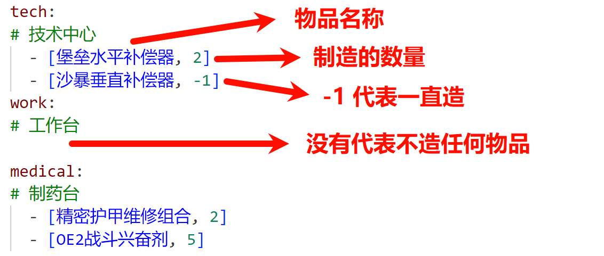

## ✔ 更新
点个星吧, 谢谢!  
应该不会再有功能性更新了, 最新版本 v1.0.1

## 免责声明
本项目仅为 **技术学习与交流** 目的开发，**并非游戏外挂或作弊工具**。严禁用于商业牟利或其他违反游戏服务条款的行为。

## 项目简介  
点个星吧, 谢谢!  

这是一个以截图, 鼠标模拟 (即鼠标宏) 来实现游戏内自动制造的程序. 不会读取, 更改任何游戏数据, 所以不存在封号风险. 利润大概 **1百50万哈弗币 / 天**  

业务逻辑大概是: 截图 -> OCR 文字识别 -> 模拟鼠标, 键盘输入  

## 使用教程  
### 1. 下载并解压:
下载: [v1.0.0](https://github.com/yi-zelin/DeltaForceSS/releases/tag/v1.0.1) 中的 `dist*.zip`  
**解压到纯英文路径!!! (Tesseract 用的 C/C++ 接口, 仅支持 ASCII)**  

> 解压后得到: 3 个文件, 以及 OCR 程序文件夹:  
> * **`Tesseract-OCR`**: OCR 程序文件夹
> * **`config.yaml`**: 数据库  
> * **`user_config.yaml`**: 用户配置文件, 包含需要制造的物品等信息
> * **`特勤处脚本.exe`**: 主程序, 需要以管理员方式运行  

### 2. 配置用户文件 `user_config.yaml` 
* `tech`, `work` ...: 需要建造的物品, 最好从 `config.yaml` 中复制  
  

  > 高级设置 (建议保持默认)
  > * `TESSERACT_PATH`: OCR 文件路径
  > * `background_mode`: 一轮运行结束会最小化游戏, 长时间后台会导致游戏断开网络连接, 所以默认 `False`  
  > * `debug_mode`: 保留一轮运行中的所有截图在 `./log` 文件夹中, 默认 `False` 就好  

### 3. 运行游戏  
* 提前准备好**无法直接购买**的物品, 例如: 钛合金, 中级子弹零件  
* **打开游戏到特勤处的制造页面** (显示制造物品与剩余时间的页面)  
* **管理员模式运行 main.exe 程序** (程序会自动切换到游戏界面)  
* **开始挂机** (程序运行结束后有低频的哔声, 之后可以切换页面或者出售仓库物品, 也可以编辑 `user_config.yaml`, 会应用在下一轮运行. 记得切换回制造页面)  

### 4. 特性
* 只支持 16:9 的分辨率设置
* 不在正确的页面会自动停止程序, 即:在游戏中程序会自动停止
* .300 BLK 需要手动置顶, 因为三种子弹名字都一样  
* 更改 `user_config` 请重启程序
* OCR 匹配失败会在 1 分钟之后重启程序, 如果多次读取失败考虑使用更高的分辨率
* 2070super 在2k分辨率, 游戏外30帧, 关闭帧生成, 最低风扇速度时温度可以控制在35度

# 📃 项目信息 

## 📌 开发中  
* 新代码压力测试, 可能不会有后续更新了
* 更好的处理兑换物品不够的情况

## 🚧 待完成  
* 使用汉字特征库  

## ✅ 已完成功能  
* 集成 Tesseract
* 自动设置屏幕尺寸 
* 不自动退出, 以更好查看程序状态
* main page 检测
* 快捷键重启
* 匹配新赛季更新
* 物品制造列表
* 更好的状态提示  
* 全物品支持  
* 聚焦与最小化  
* 根据剩余时间触发 (声音提示 + 自动聚焦)  
* dxcam 截图, 直接访问显存, 彻底解决截图不稳定问题  
* 16:9 的 1k, 2k, 4k 屏幕适配  
* 自动制造, 收集: 自动选择匹配物品, 自动开始制造  
* 自动购买材料 (不支持兑换物品)  

## 🐦 咕咕  
* 适配 720p HD: OCR 识别率不够, 需要字形库  
* 适配普通窗口模式: 像素转换导致很多函数都要改, 不如直接最小化  

## ✔ 已修复  
* 技术中心检索到瞄具就会退出
* 时间检测前刚好完成物品应该直接重启  
* 截图不稳定: 概率截到纯黑 or 只有背景 (win32)  

## 🙃 已知问题  
* .300 BLK 需要手动置顶, 三种名字一样  
* 后台时间过长可能需要重连网络, 不清楚最大间隔时间  
